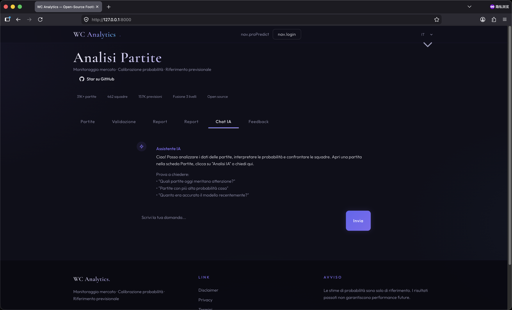
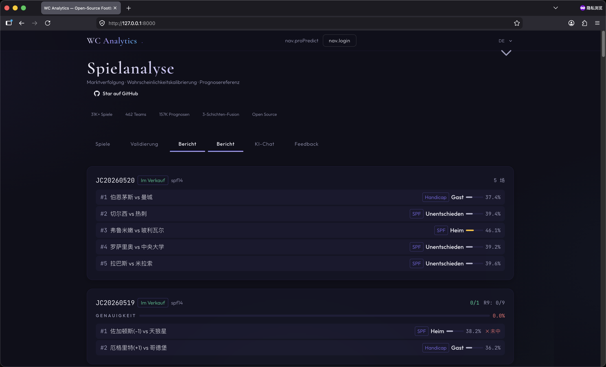
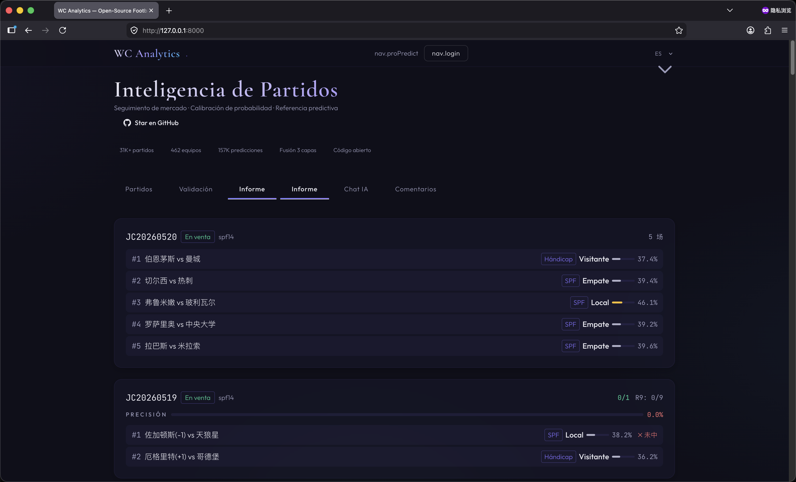
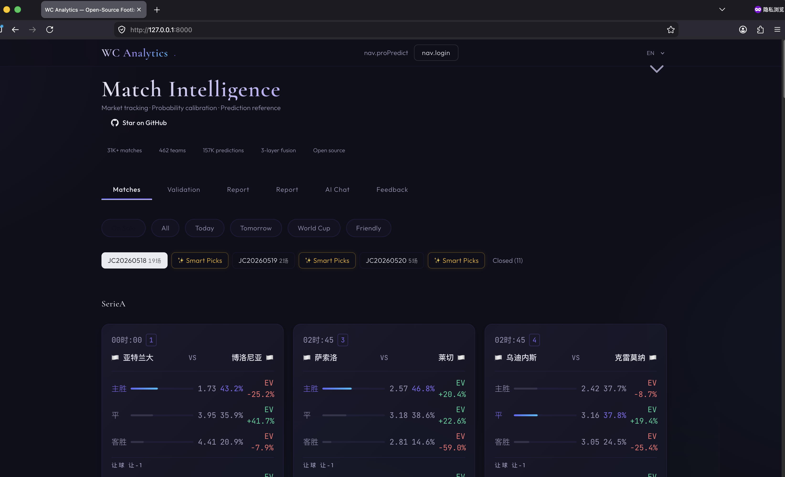

# WC Analytics — 开源足球概率校准框架

> **研究用 · 非投注工具**

[](https://creativecommons.org/licenses/by-nc-sa/4.0/)
[](https://www.python.org/)
[](https://fastapi.tiangolo.com/)
[](https://github.com/VariableLab/football/pulls)

🌐 [football.nett.to](https://football.nett.to)

[🇬🇧 English](README.md) · **🇨🇳 中文**

---

## 演示视频

<video src="https://github.com/VariableLab/football/raw/master/demo.mp4" controls width="100%">
  您的浏览器不支持视频播放。
  <a href="https://github.com/VariableLab/football/raw/master/demo.mp4">下载 MP4</a>
</video>

---

## 🎯 一句话介绍

WC Analytics 是一个**开源的足球概率校准研究框架**，帮助研究人员验证预测模型的有效性，而非提供投注建议。

🔬 学术用途 · 📊 概率输出 · 🔐 赛前快照锁定 · 🌐 全开源可复现

---

## 📝 项目描述

WC Analytics 是一个**三层融合架构**的足球赛事概率建模系统，覆盖 **31K+ 历史比赛**、**462 支球队**。我们开源代码与数据管线，供学术界验证预测模型有效性。所有输出为数学概率，赛前锁定可追溯，不提供任何投注建议。

**核心原则**：
- ✅ 只展示数学模型计算的概率数字
- ✅ 赛前快照锁定，可追溯验证
- ❌ 不构成投注建议

---

## 📸 界面预览

<table>
  <tr>
    <td></td>
    <td></td>
  </tr>
  <tr>
    <td></td>
    <td></td>
  </tr>
</table>

---

## 🎯 Maker Story

我们是一组关注体育数据分析的研究者。开发这个工具是因为发现很多"预测模型"缺乏可复现性和概率校准。我们希望推动更严谨的体育预测研究——如果你也在做相关研究，欢迎一起改进模型！

---

## 📊 当前状态

| 指标 | 数值 | 说明 |
|------|------|------|
| 比赛总数 | 31,402 | 覆盖 46 个联赛/赛事 |
| 已结束 | 31,238 | 含 230 场世界杯淘汰赛（1930-2022） |
| 球队 | 462 | 自动发现 + 手动录入 |
| 预测总数 | 157,030 | 5 种玩法全覆盖 |
| 竞彩期号 | 14 期 | 自动同步 zgzcw |
| 赔率源 | 多通道 | zgzcw + 历史数据回补 |

---

## 预测架构

```
Layer 1: 特征生成层
  ├── EloModel → 实力基线
  ├── PoissonModel(Dixon-Coles) → 攻防概率矩阵
  ├── MarketModel → 多源赔率去水
  ├── AdjustmentModels → 8 种修正因子
  ├── FormMarkovModel → 时序状态特征
  └── H2HModel → 历史交锋特征

Layer 2: 逻辑回归融合层
  └── LogisticRegression(L1, L-BFGS-B, class_weight)
      → 43 维特征 → SPF 概率输出 (全量 30K+ 训练)

Layer 3: 神经网络残差修正层
  └── ResidualNN (3 层 MLP)
      → 修正 LR 系统性偏差

Layer 4: 策略输出层
  ├── Platt Scaling 概率校准
  ├── EV 边际计算 (模型概率 vs 赔率隐含)
  ├── 4 档风险过滤
  └── Kelly 仓位优化
```

---

## 性能指标

| 指标 | LR 融合 | 目标 |
|------|:-:|:-:|
| SPF 方向准确率 | **56.6%** (回测) | ≥ 55% |
| Brier Score | **~0.185** | ≤ 0.190 |
| 淘汰赛准确率 | **49.3%** | ≥ 45% |

---

## 快速启动

```bash
cd backend
python3 -m venv venv && source venv/bin/activate
pip install -r requirements.txt
uvicorn main:app --reload --host 0.0.0.0 --port 8000
# 访问 http://localhost:8000/static/index.html
```

---

## 项目结构

```
backend/                     # 后端核心
├── main.py                  # FastAPI 应用
├── models.py                # ORM 模型 (12 表)
├── prediction_engine.py     # 预测引擎 (3 层融合)
├── scheduler.py             # 定时任务调度
├── zgzcw_jc_sync.py         # 竞彩数据同步
├── health_daemon.py         # 自检自修引擎
├── emergency_fix.py         # 诊断修复工具
│
├── features/                # 特征生成层
├── fusion/                  # LR 融合层
├── nn/                      # 神经网络
└── data/                    # 权重 & 审计数据
```

---

## License

[CC BY-NC-SA 4.0](https://creativecommons.org/licenses/by-nc-sa/4.0/) — 允许非商业学术使用，需署名+相同方式共享

---

## ⚠️ 免责声明

本项目为学术研究工具，输出结果为数学概率校准值，不构成任何投注建议。请遵守所在地法律法规，理性看待体育竞赛。

---

## 文档

详细文档移步 `docs/` 目录：

| 文档 | 说明 |
|------|------|
| [ARCHITECTURE_V2.md](docs/ARCHITECTURE_V2.md) | 系统架构文档 |
| [AUTOMATION.md](docs/AUTOMATION.md) | 自动化管线说明 |
| [ODDS_SETUP.md](docs/ODDS_SETUP.md) | 赔率数据配置 |
| [QUICKSTART.md](docs/QUICKSTART.md) | 快速上手指南 |
| [REMEDIATION_PLAN.md](docs/REMEDIATION_PLAN.md) | 修复计划 |
| [AUDIT_REPORT_20260519.md](docs/AUDIT_REPORT_20260519.md) | 审计报告 |
| [QUICK_FIX_GUIDE.md](docs/QUICK_FIX_GUIDE.md) | 快速修复指南 |
