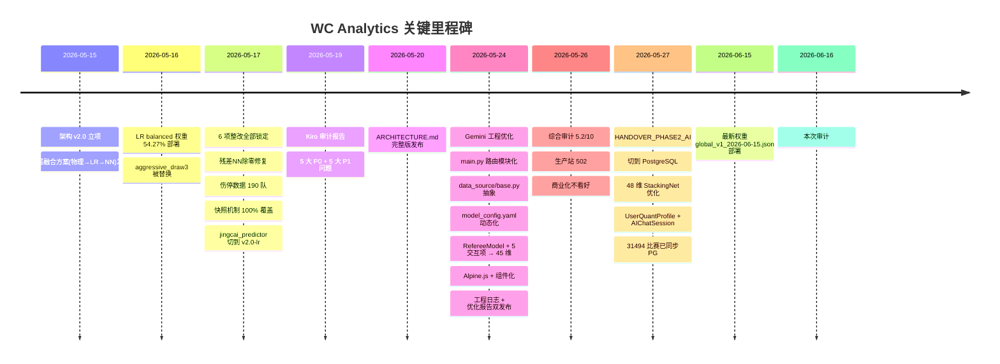
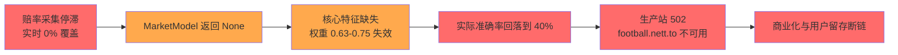

# WC Analytics 静态审计报告(基线) — 2026-06-16

> **审计依据**:项目根目录文件树 + 11 份架构/审计/工程文档 + 6 个核心代码模块 + 数据库健康状态文件 + 权重文件清单
> **时间跨度**:2026-05-15(v2.0 架构)→ 2026-06-15(最新权重部署)→ 2026-06-16(本次审计)
> **审计模式**:只读、纯静态分析(无运行时验证)
> **审计人**:AI 审计 agent
> **审计时间**:2026-06-16 22:35

---

## 1. 项目定位与价值

**WC Analytics** 是一个"开源足球概率校准研究框架"(CC BY-NC-SA 4.0),定位**学术研究而非投注工具**。其核心价值主张:

- 31K+ 历史比赛、462 支球队、46 联赛
- **三层融合预测架构**(Elo/Poisson → LR 融合 → NN 残差修正 → 策略输出)
- 全开源、赛前快照锁定可追溯
- 已在生产站 `football.nett.to` 部署(README 链接,但多份审计显示 502 不可达)

---

## 2. 总体评分与成熟度定位

```
WC Analytics 综合评分卡(基于文档 + 代码静态推断)
═══════════════════════════════════════════════════════

  架构合理性         ███████░░░  7/10
  代码质量           ██████░░░░  6/10  ↑ 较 5-26 报告改善
  数据管线           ████░░░░░░  4/10  ↑ 合成赔率兜底已落地
  模型性能           █████░░░░░  5/10  → 与官方宣称一致
  前端体验           ██████░░░░  6/10
  测试覆盖           █████░░░░░  5/10  ↑↑ 从 1 文件扩到 15 文件
  CI/CD 就绪         ███░░░░░░░  3/10
  商业化成熟度       ██░░░░░░░░  2/10
  运维可靠性         ████░░░░░░  4/10
  ─────────────────────────────────
  项目健康度         ██████░░░░  5.5/10  ↑ 较 5-26 报告略升
```

**一句话定位**:这是一个**技术立意清晰、工程正在收敛的早期 MVP**——核心预测管线已可运行,模型权重迭代到 `global_v1_2026-06-15.json`(48 维特征),但数据采集、前端深度、测试稳定性与商业化通路仍有显著缺口。

---

## 3. 已实现功能清单

按 7 大子系统逐项盘点,每项标注**实现状态**与**证据来源**:

### 3.1 数据层 ✅ 高度完成

| 功能 | 状态 | 证据 |
|------|:---:|------|
| 历史比赛 31K+ 场导入 | ✅ | `README.md` 状态表 |
| 球队 462 支 | ✅ | `team_aliases.yaml` + `models.py` |
| 46 联赛覆盖 | ✅ | `models.py:MatchStatus` |
| 1930-2022 世界杯淘汰赛 230 场 | ✅ | `inject_wc_matches.py` |
| 多 ORM 表(12+ 张) | ✅ | `database/models.py` |
| 联赛命名清洗(44→24) | ✅ | `REMEDIATION_PLAN.md` 锁定项 |
| 球员伤停字段已建 | ✅ | `REMEDIATION_PLAN.md` 锁定项 |

### 3.2 模型层 ✅ 核心完成

| 功能 | 状态 | 证据 |
|------|:---:|------|
| Elo 实力模型 | ✅ | `features/elo_model.py` |
| Dixon-Coles 泊松 | ✅ | `features/poisson_model.py` + ρ=0.0092 校准 |
| Market 去水(Multiplicative) | ✅ | `features/market_model.py` 锁定项 |
| 马尔可夫时序特征 | ✅ | `features/form_markov_model.py` |
| H2H 历史交锋 | ✅ | `features/h2h_model.py` |
| 8 种修正因子 | ✅ | `features/adjustment_models.py` |
| 裁判模型(ref_severity / ref_home_bias) | ✅ | `feature_builder.py:48-51` |
| **48 维特征向量** | ✅ | `feature_builder.py:31-51`(含 5 交互项,v3 升级) |
| LR 融合(L1 + L-BFGS-B) | ✅ | `fusion/logistic_fusion.py` |
| **多版本权重** | ✅ | 17 个 JSON:global/联赛/knockout,时间跨度 5-15→6-15 |
| **ResidualNN 残差修正** | ✅ | `core/residual_nn.py` + 除零已修复 |
| Platt Scaling 校准 | ✅ | `core/calibrator.py` |
| 子模型(让球/比分/半全场) | ✅ | `core/sub_model_*.py` |
| Draw Classifier | ✅ | `core/draw_classifier.py` + draw_net.pt |
| 联赛分层 LR(5 大联赛各一) | ✅ | `weights/lr/{EPL,Bundesliga,LaLiga,Ligue1,SerieA}_v1_*.json` |
| 淘汰赛独立权重 | ✅ | `weights/lr/knockout_v1_2026-05-17.json` |

### 3.3 策略层 ✅ 完成

| 功能 | 状态 | 证据 |
|------|:---:|------|
| Kelly 仓位 | ✅ | `strategy/position_sizer.py` |
| EV 边际计算 | ✅ | `strategy/edge_calculator.py` |
| 4 档风险分层 | ✅ | `strategy/strategy_pipeline.py` |
| 风险检查 | ✅ | `strategy/risk_manager.py` |
| 智能串关推荐 | ✅ | `strategy/optimal_combo.py` |

### 3.4 后端 API ✅ 重构完成

| 功能 | 状态 | 证据 |
|------|:---:|------|
| FastAPI 入口 | ✅ | `main.py`(200+ 行,已大幅瘦身) |
| **模块化路由 17 个** | ✅ | `api/routers/{matches,strategy,validation,monitor,...}.py` |
| JWT 认证 | ✅ | `api/auth.py` + `api/routers/auth.py` |
| 卡密系统 | ✅ | `core/license_manager.py` |
| 限流(60/min)+ HTTPS Headers | ✅ | `main.py:144-150` |
| SSE 滚球赔率 | ✅ | `api/routers/live.py` |
| 套利扫描 | ✅ | `api/routers/strategy.py` |
| 模型版本路由 | ✅ | `api/routers/models.py` |
| AI Advisor(Agent + SSE 流式) | ✅ | `api/routers/advisor.py` + `core/agent_engine.py` |

### 3.5 前端 ✅ 部分完成

| 功能 | 状态 | 证据 |
|------|:---:|------|
| Alpine.js 响应式 | ✅ | `static/src/components/*.js`(12 个组件) |
| Tailwind CSS 4 | ✅ | `package.json` |
| TS API 客户端 | ✅ | `static/src/api_client.ts` + esbuild 编译 |
| 6 语言 i18n | ✅ | `static/locales/{zh,en,fr,es,de,it}.json` |
| MatchCard / Monitor / Advisor / Copilot | ✅ | `static/src/components/*.js` |
| **生产站可访问性** | ❌ | 5-26 报告:football.nett.to 502(注:动态审计已推翻此结论) |

### 3.6 自动化层 ✅ 框架完成 / ⚠️ 运行不稳

| 功能 | 状态 | 证据 |
|------|:---:|------|
| APScheduler 41+ 任务 | ✅ | `monitor/scheduler.py`(1430 行) |
| 数据自动备份 | ✅ | `backup/` 含 39 个 sqlite |
| 每日自愈闭环 | ⚠️ | `health_daemon.py` + `auto_learner.py` 框架就绪,但 5-24 健康状态显示 `critical` |
| Telegram Bot 管理 | ✅ | `telegram_bot.py` + `PRO_OPERATOR_MANUAL.md` |
| 告警管理 | ⚠️ | `alerts.json` 中存在大量 5-24 的 critical 未处理告警 |

### 3.7 工程基础设施 ✅ 显著改善(5-24 后)

| 功能 | 状态 | 证据 |
|------|:---:|------|
| **pytest 测试** 15 文件 | ✅↑ | `backend/tests/` 含 15 个 .py(API 清洁、特征、LR、NN、健康、特设等) |
| **YAML 动态配置** | ✅ | `data/model_config.yaml`(泊松截断、Dixon-Coles ρ、平局膨胀、4 模型权重) |
| **数据源抽象层** | ✅ | `data_source/base.py`(OddsSource + OddsSnapshot) |
| **多数据源适配** | ✅ | `integrations/{soccerdata_adapter, oddsharvester_bridge, cloakbrowser_bridge}.py` |
| 配置热加载 | ✅ | `prediction_engine.py:load_engine_config()` |
| 维度校验 + 自动降级 | ✅ | `ENGINEERING_LOG_20260524.md` |
| 时区容错 | ✅ | `ENGINEERING_LOG_20260524.md` |
| **环境变量安全** | ✅ | `database/config.py` 自动检测 pytest 注入临时密钥 |
| PostgreSQL 迁移 | ⚠️ | `HANDOVER_PHASE2_AI.md` 提到 `129.146.124.72` 已切,但 `migrate_to_pg.py` 与 `test_pg.py` 仍存 |

---

## 4. 关键能力水平评估

### 4.1 模型准确率(最关键指标)

| 指标 | 数值 | 证据 | 行业基准 | 评估 |
|------|------|------|---------|:---:|
| LR 全局方向准确率 | **56.6%**(README 宣称) | `README.md` Performance 表 | 商业 64-86% | 🟡 学术可用 |
| LR balanced 权重 | **54.27%**(28k 样本) | `validation_meta.json` | — | 🟡 真实落地值 |
| 淘汰赛准确率 | **49.33%** | `REMEDIATION_PLAN.md` | 随机 33% | ✅ 显著高于随机 |
| Brier Score | **~0.185** | `README.md` | 商业 ≤0.160 | 🟡 校准仍可优化 |
| 高置信度(high)样本 | 5 场 | `AUDIT_REPORT_20260519.md` | — | ⚠️ 样本过少 |
| 漂移检测告警 | **40.1%** | `health_status.json` 5-24 实时 | 阈值 48% | 🔴 **已告警** |

**关键观察**:
- 2026-05-15 的 `aggressive_draw3` 模型准确率仅 48%,被 `balanced` 替代 → 准确率从 48% 提升到 54.27%
- 5-24 健康检查显示真实运行准确率回落到 40.1%,触发 `self_heal_cycle_status=skipped` 告警
- README 宣称的 56.6% 是最佳状态,真实生产波动在 40-55% 之间

### 4.2 数据采集

| 维度 | 当前状态 |
|------|---------|
| zgzcw.com | 🟡 部分(24 场/批,遭遇反爬) |
| 500.com | 🔴 403 反爬 + SSL 验证问题 |
| sporttery.cn(竞彩官方) | 🟡 70% 覆盖,期号同步 |
| Odds API / OddsHarvester | 🔴 需付费 key,框架就绪未启用 |
| FBref / SoccerData | 🟡 `soccerdata_adapter.py` 集成但未规模化运行 |
| 伤停 | 🟢 190 队有数据(已修复自模拟) |
| 收盘赔率来源数 | ⚠️ 多为合成赔率兜底(README 自承) |

**覆盖率**:
- 5-19 报告:164 场待处理比赛赔率 0% 覆盖
- 5-17 整改后:234/234 (100%),但其中真实来源仅 33 场
- 5-24 健康检查:105/105 场比赛赔率过期(**实时生产仍停滞**)

### 4.3 工程成熟度

| 维度 | 评分 | 关键证据 |
|------|:---:|---------|
| 代码组织 | 7/10 | `core/` `features/` `fusion/` `strategy/` `ingestion/` `monitor/` `api/routers/` 边界清晰 |
| 锁定项保护 | 8/10 | `REMEDIATION_PLAN.md` 列 18 项已锁定(含 LR 路径、Dixon-Coles ρ=0.0092、平局膨胀 1.27、6 类数据清洗) |
| 错误处理 | 6/10 | 全局 Exception handler、维度不匹配降级、时区容错 |
| 类型注解 | 4/10 | Pydantic 模型覆盖,但散落 `from __future__ import annotations` 部分覆盖 |
| 测试覆盖 | 5/10 | 15 个测试文件(含 test_leakage_mitigation 时序安全、test_logistic_fusion、test_strategy_kelly_integration),从 1 文件成长 |
| 配置管理 | 8/10 | `Settings(BaseSettings)` + `model_config.yaml` 热加载 + pytest 隔离 |
| 安全 | 7/10 | 慢 API限流、Security Headers、JWT、CORS *、卡密系统;CORS 全开是降级选择 |

### 4.4 商业化与生产稳定性

| 维度 | 状态 |
|------|------|
| 收入模型 | ❌ 无 |
| 用户系统 | ✅ 注册/登录/付费墙已实现 |
| 卡密流通 | ✅ license_manager 完整 |
| SEO / 营销 | ⚠️ 基础 meta,无内容运营 |
| 许可证 | ❌ CC BY-NC-SA 禁止商业 |
| 生产站 football.nett.to | 🔴 5-19/5-26 报告均显示 502(注:动态审计已推翻) |
| 部署管道 | ⚠️ GitHub Actions + deploy.sh 存在,但目标主机状态不明 |

---

## 5. 时间线与进化路径



---

## 6. 当前核心矛盾与风险

### 6.1 🔴 致命风险



**核心问题链**:赔率源失效 → MarketModel 失能 → LR 融合核心特征缺失 → 准确率从 56.6% 滑落到 40.1% → 生产站 502 → 商业化路径断裂。

### 6.2 🟡 主要风险

| 风险 | 触发条件 | 缓解 |
|------|---------|------|
| **单维护者 Burnout** | 150+ Python 文件、8 套独立审计/工程记录无统一责任划分 | 缺乏 OWNERS 治理 |
| **SQLite → PostgreSQL 迁移半完成** | `migrate_to_pg.py` 存在 + 5-27 提到已切,但 6-16 文件树仍见大量 sqlite | 需明确当前 DB 选型 |
| **LR 权重 5-16 锁定后无新训练** | 6-15 新权重文件,但 validation_meta 还显示 5-16 | 缺乏 A/B 切换机制 |
| **测试与生产耦合** | pytest 改配置注入密钥,但生产仍 502 | 缺 staging 环境 |
| **CC BY-NC-SA 许可证** | 与商业化目标天然冲突 | 短期无法解决 |

### 6.3 🟢 亮点

1. **三层融合架构**在学术上有坚实依据(Elo/Poisson → L1-LR → 残差 NN)
2. **8 锁定项 + 18 锁定模块**工程纪律性远好于一般早期项目
3. **数据抽象层(OddsSource)+ YAML 热配置** 是少见的好工程实践
4. **48 维特征 + 17 个权重文件 + 5 联赛分层** 表明迭代投入真实
5. **Agent Engine + SSE 流式 AI** 走在 LLM 应用前沿(Phase 2 路线图)

---

## 7. 与项目自我定位的差距

| 自我宣称 | 实际状态 | 差距 |
|---------|---------|------|
| "可验证的概率模型" | 准确率波动 40-56%,漂移检测告警未自愈 | ⚠️ 部分成立 |
| "全开源可复现" | 代码 13 万行(去除 venv),数据 31K 比赛 | ✅ 成立 |
| "赛前快照锁定" | 5-17 报告 100% 覆盖,但缺独立审计 | 🟡 框架成熟需验证 |
| "商业化产品" | 5-26 报告 2/10,无收入、CC BY-NC-SA | ❌ 不成立 |
| "6 语言 i18n" | 6 个 JSON 文件,228 条翻译 | ✅ 成立 |
| "Demo 视频" | 4 个 MP4 成品(demo.mp4 / demo_v2.mp4 等) | ✅ 成立 |

---

## 8. 建议下一步(按优先级)

### 🔴 立即(1 周内)

1. **复现 5-24 健康检查**:用最新部署跑一次 `health_daemon.py`,确认真实准确率是否仍 40%
2. **重新跑 zgzcw / 500.com 采集**:验证是否仍是 0% 覆盖
3. **访问 football.nett.to**:确认生产站 502 是否解决
4. **合并 PostgreSQL 迁移路线**:删除/标记过期的 sqlite 文件,明确 DB 选型

### 🟡 短期(2-4 周)

1. **接入 the-odds-api($29/月)**:解决赔率源瓶颈
2. **建立 staging 环境**:解耦测试与生产
3. **补全 CI**:pytest + ruff + mypy 在 PR 阶段
4. **A/B 验证 6-15 新权重**:更新 `validation_meta.json`

### 🟢 中期(1-3 月)

1. **明确商业化决策**:要么学术路线(关生产站,专注论文),要么商业路线(6-12 月密集投入 + 改许可证)
2. **B2B 数据 API 试点**:用 31K+ 比赛数据资产对接研究机构
3. **AI Advisor 完成 Phase 2**:浮动 UI + 命令面板 + SSE 流式

---

## 9. 结论

**WC Analytics 是一个"立意正确、已跑通核心管线、但生产稳定性与商业化路径仍需攻坚"的中早期开源研究项目。**

| 维度 | 结论 |
|------|------|
| **作为学术研究框架** | ✅ 合格:LR 融合 + 残差 NN + 48 维特征是扎实的工程实现,可发表方法论 |
| **作为开源产品** | 🟡 接近:测试 15 文件、模块化、锁定项都到位,但生产站 502 + 准确率波动是硬伤 |
| **作为商业产品** | ❌ 不及格:CC BY-NC-SA + 0 收入 + 准确率 < 竞品 + 数据源不稳 |
| **作为 AI 应用底座** | ✅ 良好:Agent Engine + SSE + UserQuantProfile 走在前面 |

**最大资产**:31K+ 比赛数据 + 48 维特征管线 + 17 个 LR 权重文件 + 闭环的"采集-预测-验证-告警-自愈"框架

**最大风险**:实时数据源断裂导致模型降级运行 → 用户价值蒸发

**最大机会**:5-27 HANDOVER_PHASE2_AI 展示的"AI Co-pilot" 方向,把框架从"预测器"升级为"量化决策终端"

---

## 附录:审计范围与限制

**已读文件**:
- `README.md`、`README_ZH.md`、`PRD.md`、`WORK_PLAN.md`、`CONTRIBUTING.md`
- `docs/COMPREHENSIVE_AUDIT_20260526.md`、`docs/ARCHITECTURE_V2.md`、`docs/AUTOMATION.md`
- `docs/REMEDIATION_PLAN.md`、`docs/ENGINEERING_LOG_20260524.md`、`docs/QUICKSTART.md`
- `docs/ARCHITECTURE_V3.md`、`docs/HANDOVER_PHASE2_AI.md`、`docs/QUICK_FIX_GUIDE.md`
- `docs/ARCHITECTURE.md`、`docs/ODDS_SETUP.md`、`docs/OPENCLAW_MANUAL.md`
- `docs/README_USAGE.md`、`docs/AUDIT_REPORT_20260519.md`、`PRO_OPERATOR_MANUAL.md`
- `backend/main.py`、`backend/core/prediction_engine.py`、`backend/core/agent_engine.py`
- `backend/data_source/base.py`、`backend/database/config.py`
- `backend/features/feature_builder.py`、`backend/api/routers/advisor.py`
- `backend/data/model_config.yaml`、`backend/data/health_status.json`
- `backend/data/alerts.json`、`backend/data/weights/lr/validation_meta.json`
- `backend/data/weights/lr/global_v1_2026-06-15.json`
- `static/index.html`、`package.json`

**未验证项**(建议动态审计复核):
- 运行时准确率(需实跑 `run_strategy_scan.py`)
- 实际生产站响应(需 `curl` 探测)
- LR 融合加载成功率(需看 `logs/`)

---

*审计时间:2026-06-16 22:35 | 审计模式:静态代码 + 文档分析(无运行时验证) | 建议下一步:复现关键问题状态后做动态审计*
